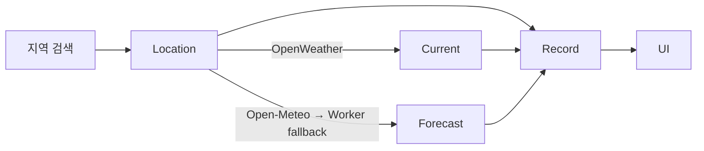

# Core Weather Objects

Weather Board는 `Location`, `Current`, `Forecast`를 ID로 연결하고, 화면에서만 하나의 `Record`로 합칩니다.

## Location

등록한 지역의 변하지 않는 정보입니다.

```js
{
  id: 'seoul-kr',
  name: '서울',
  englishName: 'Seoul',
  state: '',
  country: 'KR',
  region: 'KR',
  lat: 37.5665,
  lon: 126.978,
  addedAt: 0,
}
```

- `id`는 `영문 지역명-행정구역-국가`를 slug로 만든 값입니다.
- 상세 URL, 메인 지역 설정, Store 관계 키에 같은 ID를 사용합니다.
- ID는 등록 시 한 번만 만들고 날씨 갱신 시 다시 계산하지 않습니다.

## Current

OpenWeather 현재 날씨를 앱 필드로 바꾼 값입니다.

```js
{
  temp: 26,
  feelsLike: 27,
  status: '맑음',
  kind: 'clear',
  night: false,
  humidity: 60,
  windSpeed: 2.1,
  fetchedAt: 0,
}
```

`kind`는 API 표현을 화면 공통 분류로 바꾼 값입니다.

```text
clear | clouds | rain | snow | thunder | mist
```

## Forecast

Open-Meteo의 앞으로 24시간과 7일 예보입니다.

```js
{
  hourly: [{ time, temp, feelsLike, humidity, rainChance, windSpeed, kind }],
  daily: [{ date, min, max, rainChance, precipitation, kind }],
  timezone: 'Asia/Seoul',
  fetchedAt: 0,
}
```

예보는 상세 화면과 메인 대표 지역에서 필요할 때만 요청하며 localStorage에는 저장하지 않습니다.
첫 예보 요청은 Open-Meteo에 직접 보내고, 한도 초과·차단·네트워크 또는 서버 오류가
발생하면 Cloudflare Worker로 다시 요청합니다. Worker 연결이 성공하면 해당 앱 세션의
이후 예보는 Worker를 사용합니다.

## Record

UI에서 사용하는 파생 객체입니다. 별도로 저장하지 않습니다.

```text
Record = locations[id] + currentById[id] + forecastById[id]
```

Pinia의 `weather(id)`와 `weatherList` getter가 Record를 만듭니다. 과제 변수인 `weatherList`, `filteredWeatherList`, `selectedCityInfo`가 사용하는 객체도 이 Record입니다.

## Store

```js
{
  locationIds: ['seoul-kr'],
  locations: { 'seoul-kr': Location },
  currentById: { 'seoul-kr': Current },
  forecastById: { 'seoul-kr': Forecast },
}
```

localStorage의 `weather-dashboard:v2`에는 `locationIds`, `locations`, `currentById`만 저장합니다. 아직 배포 전인 프로토타입이므로 이전 저장 형식의 마이그레이션은 제공하지 않습니다.

## Data Flow



| 모듈 | 공개 함수 또는 상태 | 책임 |
| --- | --- | --- |
| `openWeatherApi.js` | `search()`, `current()` | 지역·현재 날씨 호출과 정규화 |
| `openMeteoApi.js` | `forecast()` | 직접 호출·Worker 전환과 시간별·주간 예보 정규화 |
| `weather.js` | `load()`, `add()`, `remove()`, `refresh()`, `loadForecast()` | ID 관계, 저장, 캐시 갱신 |
| `weatherVisuals.js` | `getVisual()` | 공통 `kind`를 아이콘·배경·필터로 변환 |
