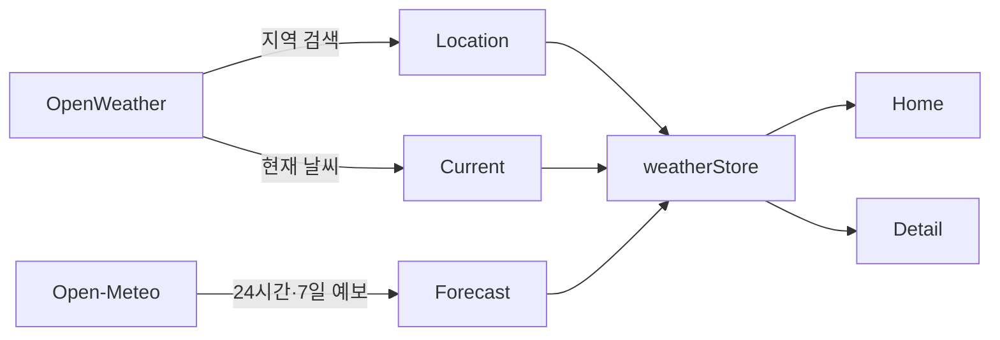

# Weather Board IA

## Routes

```text
Weather Board
├── Weather Home                         /
│   ├── 대표 지역 현재 날씨
│   ├── 대표 지역 24시간·주간 예보 미리보기
│   ├── 등록 지역 검색·필터
│   └── Weather Card Grid
├── Weather Detail                       /weather/:id
│   ├── 현재 관측 정보
│   ├── 앞으로 24시간 예보
│   └── 7일 예보
├── About                                /about
└── Not Found                            /:pathMatch(.*)*
```

## Data Sources



- OpenWeather: 지역 검색과 현재 날씨
- Open-Meteo: 대표 또는 상세 지역의 예보
- 현재 날씨는 2시간, 예보는 1시간 동안 캐시합니다.
- Forecast는 메모리 캐시만 사용합니다.

## Component Responsibilities

| 영역 | 컴포넌트 | 책임 |
| --- | --- | --- |
| App | `App.vue` | 초기 저장 데이터 로드, 배경, Header, RouterView |
| Settings | `SettingsToolbar` | 메인 지역, 현재 위치, 전체 갱신 |
| Home | `WeatherHomeView` | 과제 검색·선택 상태와 대표 지역 구성 |
| Home | `CityRegistrationModal` | 지역 검색 후 Current 조회·등록 |
| Home | `WeatherCard` | 등록 지역 요약, 선택, 상세 이동 |
| Forecast | `ForecastPanel` | 메인 미리보기와 상세 예보 표시 |
| Detail | `WeatherDetailView` | ID로 Record 조회, 현재·예보 상세 표시 |

## Selection Rules

- `primaryId`는 저장되는 대표 지역 ID입니다.
- `selectedCityInfo`는 사용자가 현재 화면에서 카드를 선택했을 때만 생깁니다.
- 새로고침 직후에는 카드가 자동 선택되지 않으며 선택 안내 문구를 표시합니다.
- 상세 URL에는 `seoul-kr`처럼 의미 있는 Location ID를 사용합니다.

## Responsive Layout

- Desktop: 등록 지역 3열, 예보 가로 목록
- Tablet: 등록 지역 2열
- Mobile: 등록 지역 1열, 예보 가로 스크롤, 주간 행 축약
- Desktop Header는 아래 스크롤 시 숨고 위 스크롤 시 나타납니다.
