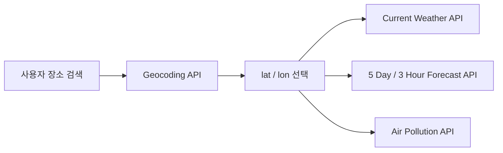

# OpenWeather Free Plan API 명세

> 조사 기준일: 2026-08-04  
> 대상: OpenWeather의 일반 Free Plan을 사용하는 날씨 대시보드  
> 기준 문서: [OpenWeather Pricing](https://openweathermap.org/price), [Detailed Pricing](https://openweathermap.org/full-price), 각 API 공식 문서

## 1. Free Plan 범위

OpenWeather의 일반 Free Plan은 영구 무료 플랜이며 다음 한도가 계정 단위로 적용됩니다.

| 항목             | Free Plan 기준                         |
| ---------------- | -------------------------------------- |
| 요금             | 무료                                   |
| 호출 한도        | 분당 60회                              |
| 월간 한도        | 월 1,000,000회                         |
| 한도 집계        | API Key별이 아닌 계정 전체 사용량 합산 |
| 날씨 데이터 갱신 | 공식 상세 가격표 기준 2시간마다        |
| 인증             | 모든 요청에 API Key 필요               |

Free Plan에 포함되는 API는 다음과 같습니다.

| API                         | 제공 정보                                       | Free Plan |
| --------------------------- | ----------------------------------------------- | --------- |
| Current Weather API         | 현재 기온, 체감 온도, 날씨, 습도, 기압, 풍속 등 | 포함      |
| 5 Day / 3 Hour Forecast API | 향후 5일간 3시간 간격 예보                      | 포함      |
| Geocoding API               | 장소명·우편번호와 좌표 간 변환                  | 포함      |
| Air Pollution API           | 현재·4일 예보·과거 대기오염 데이터              | 포함      |
| Weather Maps 1.0 API        | 구름, 강수, 기압, 바람, 기온 등의 지도 타일     | 포함      |

### One Call API 주의사항

One Call API 4.0은 일반 Free Plan에 포함된 API가 아니다. 별도의 Pay-as-you-call 구독이며 하루 1,000회까지 무료지만, 구독 과정에서 결제 정보를 등록하고 무료 한도를 초과하면 과금된다. 본 프로젝트의 기본 연동 범위에서는 제외한다.

## 2. 공통 요청 규칙

### 2.1 호스트와 인증

```text
Weather API  : https://api.openweathermap.org
Geocoding API: https://api.openweathermap.org/geo/1.0
Map Tile API : https://tile.openweathermap.org
```

API Key는 모든 요청의 `appid` Query Parameter로 전달한다.

```http
GET /data/2.5/weather?lat=37.5665&lon=126.9780&appid={API_KEY}
```

### 2.2 공통 Query Parameter

| Parameter | 필수              | 값                               | 설명                                               |
| --------- | ----------------- | -------------------------------- | -------------------------------------------------- |
| `appid`   | 필수              | API Key                          | OpenWeather 계정에서 발급받은 Key                  |
| `lat`     | 위치 API에서 필수 | `-90`~`90`                       | 위도                                               |
| `lon`     | 위치 API에서 필수 | `-180`~`180`                     | 경도                                               |
| `units`   | 선택              | `standard`, `metric`, `imperial` | 온도와 풍속 단위 체계. 기본값은 `standard`         |
| `lang`    | 선택              | `kr` 등                          | 날씨 설명의 언어. OpenWeather의 한국어 코드는 `kr` |
| `mode`    | 선택              | API별 `json`, `xml`, `html`      | 생략하면 JSON                                      |

이 프로젝트에서는 다음 값을 기본으로 사용한다.

```text
units=metric&lang=kr
```

| 데이터         | `metric` 단위       |
| -------------- | ------------------- |
| 온도·체감 온도 | °C                  |
| 풍속·돌풍      | m/s                 |
| 기압           | hPa                 |
| 습도·구름량    | %                   |
| 가시거리       | m                   |
| 강수·적설      | mm 또는 mm/h        |
| 시간           | Unix timestamp, UTC |

### 2.3 위치 조회 원칙

OpenWeather는 날씨 API를 도시명이나 City ID로 직접 호출하는 기존 Built-in Geocoder 방식을 deprecated로 안내한다. 따라서 다음 순서를 사용한다.



## 3. Geocoding API

공식 문서: [Geocoding API](https://openweathermap.org/api/geocoding-api)

### 3.1 장소명으로 좌표 검색

```http
GET https://api.openweathermap.org/geo/1.0/direct
    ?q={city name},{state code},{country code}
    &limit={limit}
    &appid={API_KEY}
```

한국 도시 검색 예시:

```http
GET https://api.openweathermap.org/geo/1.0/direct?q=서울,KR&limit=5&appid={API_KEY}
```

| Parameter | 필수 | 설명                                                        |
| --------- | ---- | ----------------------------------------------------------- |
| `q`       | 필수 | 장소명. 필요하면 주 코드와 ISO 3166 국가 코드를 쉼표로 연결 |
| `limit`   | 선택 | 반환할 후보 수. 최대 5                                      |
| `appid`   | 필수 | API Key                                                     |

응답은 배열이며 장소에 따라 일부 필드가 없을 수 있다.

```json
[
  {
    "name": "Seoul",
    "local_names": {
      "ko": "서울"
    },
    "lat": 37.5666791,
    "lon": 126.9782914,
    "country": "KR",
    "state": "Seoul"
  }
]
```

| Field         | 설명                                             |
| ------------- | ------------------------------------------------ |
| `name`        | 검색된 장소명                                    |
| `local_names` | 언어 코드별 지역명. 장소에 따라 제공 언어가 다름 |
| `lat`, `lon`  | 위도, 경도                                       |
| `country`     | ISO 3166 국가 코드                               |
| `state`       | 행정 구역. 제공되는 경우에만 존재                |

### 3.2 좌표로 장소명 검색

```http
GET https://api.openweathermap.org/geo/1.0/reverse
    ?lat={lat}
    &lon={lon}
    &limit={limit}
    &appid={API_KEY}
```

응답 필드는 Direct Geocoding과 동일한 구조다.

### 3.3 우편번호로 좌표 검색

```http
GET https://api.openweathermap.org/geo/1.0/zip
    ?zip={zip code},{country code}
    &appid={API_KEY}
```

주요 응답 필드는 `zip`, `name`, `lat`, `lon`, `country`다.

## 4. Current Weather API

공식 문서: [Current Weather API](https://openweathermap.org/api/current)

### 4.1 Endpoint

```http
GET https://api.openweathermap.org/data/2.5/weather
    ?lat={lat}
    &lon={lon}
    &units=metric
    &lang=kr
    &appid={API_KEY}
```

| Parameter    | 필수 | 설명                         |
| ------------ | ---- | ---------------------------- |
| `lat`, `lon` | 필수 | Geocoding API에서 얻은 좌표  |
| `appid`      | 필수 | API Key                      |
| `units`      | 선택 | `metric` 사용 권장           |
| `lang`       | 선택 | 한국어 날씨 설명은 `kr`      |
| `mode`       | 선택 | `xml`, `html`; 생략하면 JSON |

### 4.2 가져올 수 있는 정보

| Field                               | 설명                               | 단위/형식                   |
| ----------------------------------- | ---------------------------------- | --------------------------- |
| `coord.lat`, `coord.lon`            | 조회 좌표                          | number                      |
| `weather[].id`                      | 날씨 상태 코드                     | number                      |
| `weather[].main`                    | 날씨 상태 그룹                     | `Rain`, `Snow`, `Clouds` 등 |
| `weather[].description`             | 지역화된 상세 날씨 설명            | string                      |
| `weather[].icon`                    | 날씨 아이콘 ID                     | string                      |
| `main.temp`                         | 현재 기온                          | °C                          |
| `main.feels_like`                   | 체감 온도                          | °C                          |
| `main.temp_min`, `main.temp_max`    | 현재 시점 도시 내 최저·최고 관측값 | °C                          |
| `main.pressure`                     | 해수면 기준 기압                   | hPa                         |
| `main.sea_level`, `main.grnd_level` | 해수면·지면 기압                   | hPa, 제공 시                |
| `main.humidity`                     | 습도                               | %                           |
| `visibility`                        | 가시거리, 최대 10km                | m                           |
| `wind.speed`                        | 풍속                               | m/s                         |
| `wind.deg`                          | 풍향                               | degree                      |
| `wind.gust`                         | 돌풍                               | m/s, 제공 시                |
| `clouds.all`                        | 구름량                             | %                           |
| `rain.1h`, `snow.1h`                | 최근 1시간 강수·적설량             | mm/h, 발생 시에만 제공      |
| `dt`                                | 데이터 계산 시각                   | Unix UTC                    |
| `sys.country`                       | 국가 코드                          | string                      |
| `sys.sunrise`, `sys.sunset`         | 일출·일몰                          | Unix UTC                    |
| `timezone`                          | UTC와의 시차                       | seconds                     |
| `id`, `name`                        | OpenWeather 도시 ID와 도시명       | Built-in Geocoder 관련 값   |

`rain`, `snow`, `wind.gust`, 일부 기압 필드는 해당 현상이 없거나 계산되지 않으면 응답에서 생략된다. 항상 Optional Field로 처리해야 한다.

### 4.3 프로젝트 데이터 매핑

| 현재 UI Field | OpenWeather Field                    |
| ------------- | ------------------------------------ |
| `name`        | Geocoding의 `local_names.ko ?? name` |
| `region`      | Geocoding의 `state`, `country` 조합  |
| `temp`        | `main.temp`                          |
| `feelsLike`   | `main.feels_like`                    |
| `status`      | `weather[0].main`                    |
| `description` | `weather[0].description`             |
| `humidity`    | `main.humidity`                      |
| `windSpeed`   | `wind.speed`                         |
| 날씨 아이콘   | `weather[0].icon`                    |

아이콘 URL 형식:

```text
https://openweathermap.org/img/wn/{icon}@2x.png
```

## 5. 5 Day / 3 Hour Forecast API

공식 문서: [5 Day / 3 Hour Forecast API](https://openweathermap.org/api/forecast5)

### 5.1 Endpoint

```http
GET https://api.openweathermap.org/data/2.5/forecast
    ?lat={lat}
    &lon={lon}
    &units=metric
    &lang=kr
    &appid={API_KEY}
```

향후 5일을 3시간 단위로 반환하므로 전체 조회 시 일반적으로 최대 40개 시점이 들어온다.

| Parameter    | 필수 | 설명                  |
| ------------ | ---- | --------------------- |
| `lat`, `lon` | 필수 | 조회 좌표             |
| `appid`      | 필수 | API Key               |
| `units`      | 선택 | 단위 체계             |
| `lang`       | 선택 | 날씨 설명 언어        |
| `cnt`        | 선택 | 반환할 시점 개수 제한 |
| `mode`       | 선택 | `xml`; 생략하면 JSON  |

### 5.2 주요 응답 정보

| Field                           | 설명                                        |
| ------------------------------- | ------------------------------------------- |
| `cnt`                           | 반환된 예보 시점 개수                       |
| `list[].dt`, `list[].dt_txt`    | 예보 시각, Unix UTC와 UTC 문자열            |
| `list[].main`                   | 기온, 체감 온도, 최저·최고 기온, 기압, 습도 |
| `list[].weather[]`              | 날씨 코드, 그룹, 설명, 아이콘               |
| `list[].clouds.all`             | 구름량                                      |
| `list[].wind`                   | 풍속, 풍향, 돌풍                            |
| `list[].visibility`             | 가시거리                                    |
| `list[].pop`                    | 강수 확률. `0`~`1` 범위                     |
| `list[].rain.3h`                | 최근 3시간 강수량, 제공 시                  |
| `list[].snow.3h`                | 최근 3시간 적설량, 제공 시                  |
| `list[].sys.pod`                | 주간 `d` 또는 야간 `n`                      |
| `city.coord`                    | 도시 좌표                                   |
| `city.country`, `city.timezone` | 국가 코드와 UTC 시차                        |
| `city.sunrise`, `city.sunset`   | 일출·일몰                                   |

이 API는 일별 최저·최고 기온을 직접 제공하는 Daily Forecast가 아니다. 일 단위 요약이 필요하면 `city.timezone`을 반영해 같은 현지 날짜의 3시간 예보를 묶은 뒤 최솟값·최댓값을 계산한다.

## 6. Air Pollution API

공식 문서: [Air Pollution API](https://openweathermap.org/api/air-pollution)

### 6.1 Endpoints

```http
# 현재 대기오염
GET https://api.openweathermap.org/data/2.5/air_pollution
    ?lat={lat}&lon={lon}&appid={API_KEY}

# 4일간 1시간 단위 대기오염 예보
GET https://api.openweathermap.org/data/2.5/air_pollution/forecast
    ?lat={lat}&lon={lon}&appid={API_KEY}

# 과거 대기오염
GET https://api.openweathermap.org/data/2.5/air_pollution/history
    ?lat={lat}&lon={lon}&start={UNIX_UTC}&end={UNIX_UTC}&appid={API_KEY}
```

과거 데이터는 공식 문서 기준 2020-11-27부터 제공된다.

### 6.2 응답 정보

```json
{
  "coord": [126.978, 37.5665],
  "list": [
    {
      "dt": 1606147200,
      "main": { "aqi": 2 },
      "components": {
        "co": 203.609,
        "no": 0,
        "no2": 0.396,
        "o3": 75.102,
        "so2": 0.648,
        "pm2_5": 23.253,
        "pm10": 92.214,
        "nh3": 0.117
      }
    }
  ]
}
```

| Field              | 설명                             | 단위                                        |
| ------------------ | -------------------------------- | ------------------------------------------- |
| `main.aqi`         | OpenWeather 대기질 지수, `1`~`5` | 1 좋음, 2 양호, 3 보통, 4 나쁨, 5 매우 나쁨 |
| `components.co`    | 일산화탄소                       | μg/m³                                       |
| `components.no`    | 일산화질소                       | μg/m³                                       |
| `components.no2`   | 이산화질소                       | μg/m³                                       |
| `components.o3`    | 오존                             | μg/m³                                       |
| `components.so2`   | 이산화황                         | μg/m³                                       |
| `components.pm2_5` | 초미세먼지                       | μg/m³                                       |
| `components.pm10`  | 미세먼지                         | μg/m³                                       |
| `components.nh3`   | 암모니아                         | μg/m³                                       |
| `dt`               | 측정 또는 예보 시각              | Unix UTC                                    |

OpenWeather AQI는 한국의 통합대기환경지수(CAI)와 기준이 다르므로 UI에서 단순히 국내 등급으로 표기해서는 안 된다.

## 7. Weather Maps 1.0 API

공식 문서: [Weather Maps 1.0](https://openweathermap.org/api/weathermaps)

### 7.1 Tile Endpoint

```http
GET https://tile.openweathermap.org/map/{layer}/{z}/{x}/{y}.png?appid={API_KEY}
```

| Path/Query | 필수 | 설명                 |
| ---------- | ---- | -------------------- |
| `layer`    | 필수 | 날씨 지도 Layer 이름 |
| `z`        | 필수 | 지도 Zoom Level      |
| `x`, `y`   | 필수 | Slippy Map Tile 좌표 |
| `appid`    | 필수 | API Key              |

공식 Weather Maps 1.0 문서에 명시된 대표 Layer는 다음과 같다.

| Layer               | 정보        |
| ------------------- | ----------- |
| `clouds_new`        | 구름량      |
| `precipitation_new` | 강수        |
| `pressure_new`      | 해수면 기압 |
| `wind_new`          | 풍속        |
| `temp_new`          | 기온        |

응답은 JSON이 아니라 투명 배경을 포함할 수 있는 PNG 지도 Tile이다. Leaflet, OpenLayers 또는 Google Maps의 Tile Layer로 중첩해 사용한다.

## 8. 오류 명세

OpenWeather는 HTTP Status와 응답의 `cod` 값을 함께 반환한다. `cod`는 API와 오류 종류에 따라 문자열 또는 숫자일 수 있다. 현재 프로젝트는 별도 오류 모델로 정규화하지 않고 Axios 오류를 그대로 전달한다.

```json
{
  "cod": 401,
  "message": "Invalid API key. Please see https://openweathermap.org/faq#error401 for more info."
}
```

| Status                     | 원인                                                    | 현재 프로젝트 처리             |
| -------------------------- | ------------------------------------------------------- | ------------------------------ |
| `400`                      | 좌표·기간·Parameter 형식 오류                           | 자동 갱신은 Console 기록       |
| `401`                      | Key 누락, 잘못된 Key, Key 활성화 대기, 플랜 외 API 호출 | 자동 갱신은 Console 기록       |
| `404`                      | 장소 또는 리소스를 찾지 못함                            | 검색 화면에서 요청 실패 표시   |
| `429`                      | 분당·월간 호출 한도 초과                                | Console 기록, 자동 재시도 없음 |
| `500`, `502`, `503`, `504` | OpenWeather 서버 오류                                   | Console 기록, 자동 재시도 없음 |

## 9. 프로젝트 연동 기준

### 9.1 현재 요청 흐름

1. 도시 검색 시 Geocoding API를 직접 호출한다.
2. 사용자가 후보를 선택하면 해당 좌표의 Current Weather를 한 번 호출해 배열에 추가한다.
3. 사이트 접속 시 마지막 수신 후 2시간이 지난 등록 도시만 갱신한다.
4. 상단 새로고침 버튼을 누르면 등록 도시 전체를 갱신한다.
5. 실패한 자동 갱신은 Console에만 기록하고 재시도하지 않는다.

### 9.2 localStorage 정책

- 위치 정보와 Current Weather 응답을 결합한 `weatherList` 배열 전체를 JSON으로 저장한다.
- 별도 Geocoding Cache, 호출 횟수 추적, Rate Limit cooldown 상태를 저장하지 않는다.
- 갱신 실패 시 해당 배열 항목의 마지막 날씨를 그대로 유지한다.

### 9.3 API Key 보안

Vite의 `VITE_` 접두사 환경 변수는 빌드된 브라우저 코드에 포함되므로 비밀이 아니다.

```dotenv
# 로컬 개발에서만 사용 가능하지만 브라우저에서 노출됨
VITE_OPENWEATHER_API_KEY=replace_me
```

아래 내용은 현재 과제 범위가 아니라 추후 프로덕션 개선 시 고려할 구조다.

```text
Vue Client → 자체 Backend/Serverless Proxy → OpenWeather API
```

- API Key는 Backend의 비공개 환경 변수에 저장한다.
- `.env`, `.env.local`은 Git에 Commit하지 않는다.
- Backend에서 Origin 제한, Rate Limit, Cache를 적용한다.
- OpenWeather 오류 응답을 필요한 정보만 남긴 내부 오류 형식으로 변환한다.

## 10. Free Plan에서 제외되는 주요 정보

일반 Free Plan만으로는 다음 기능을 사용할 수 없다.

- 분 단위 1시간 예보
- 15분 단위 48시간 예보
- 4일 Hourly Forecast API
- 16일·30일 Daily Forecast API
- 정부기관 기상 특보
- 일반 날씨의 과거 관측 데이터
- Weather Maps 2.0의 예보·과거 Layer
- One Call API 4.0 통합 응답

필요한 경우 유료 플랜 또는 별도 Pay-as-you-call 상품을 검토해야 한다.

## 11. 공식 문서

- [Free Weather API access와 가격](https://openweathermap.org/price)
- [플랜별 상세 한도와 데이터 갱신 주기](https://openweathermap.org/full-price)
- [API Key와 호출 관리 가이드](https://openweathermap.org/appid)
- [Geocoding API](https://openweathermap.org/api/geocoding-api)
- [Current Weather API](https://openweathermap.org/api/current)
- [5 Day / 3 Hour Forecast API](https://openweathermap.org/api/forecast5)
- [Air Pollution API](https://openweathermap.org/api/air-pollution)
- [Weather Maps 1.0 API](https://openweathermap.org/api/weathermaps)
- [API FAQ와 오류](https://openweathermap.org/faq)
