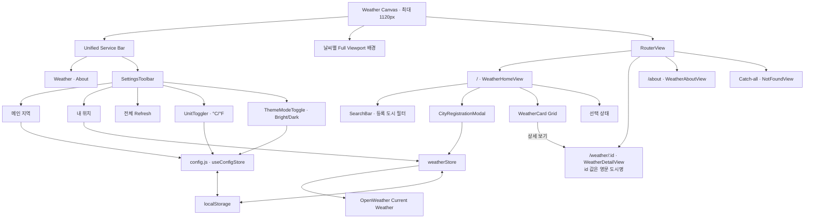
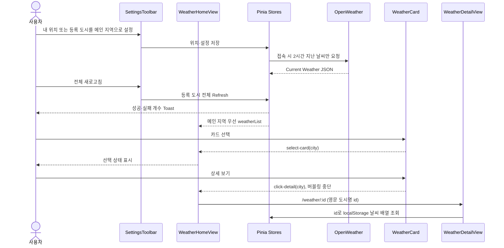

<!-- AI GENERATED CODE: 현재 Weather Canvas 구현에 맞춰 정보 구조와 시각 계층을 동기화했습니다. -->

# Weather Board IA

> 실제 OpenWeather 데이터, Pinia 설정, 등록 지역 Grid를 기준으로 정리한 현재 정보 구조입니다.

## 1. 서비스 구조



## 2. 사이트맵

```text
Weather Board
├── Global Settings
│   ├── 메인 지역
│   ├── 내 위치 등록
│   ├── 전체 날씨 새로고침
│   ├── 섭씨 / 화씨
│   └── Bright / Dark
├── Weather                                      /
│   ├── 등록 도시 검색
│   ├── 도시 추가
│   ├── 현재 선택 상태
│   └── Weather Card Grid
│       └── Weather Report                       /weather/:id (예: /weather/seoul)
├── About                                        /about
└── Not Found                                    /:pathMatch(.*)*
```

## 3. 화면별 정보 계층

### Weather Home

1. 메인 지역의 현재 온도·상태와 Unicode 날씨 기호
2. 습도·바람(풍속·풍향)·강수/적설·일몰을 담은 Glass Metric Strip
3. 도시 필터와 도시 추가
4. 선택 상태
5. 메인 지역 우선 Weather Card Grid
   - 도시와 지역
   - 현재·체감 온도
   - 습도·풍속·구름량
   - 25도 기준 과제 라벨
   - 마지막 갱신과 2시간 경과 상태
   - 삭제와 상세 이동

### Weather Detail

1. 메인 지역 여부, 도시, 설명, 관측 시각
2. 현재·체감 온도와 날씨 아이콘
3. 습도·풍속·기압·가시거리 Metric Grid
4. 관측 온도 범위, 풍향·돌풍, 구름, 강수·적설, 일출·일몰
5. 마지막 정상 데이터 갱신 상태

### About

1. 서비스 목적
2. 내 위치·2시간 자동 Refresh·개인화 기능
3. localStorage 데이터 정책

## 4. 컴포넌트 책임

| 영역     | 컴포넌트/모듈           | 책임                                                    |
| -------- | ----------------------- | ------------------------------------------------------- |
| App      | `App.vue`               | 날씨 배경 전환, Floating Navigation, RouterView, Footer |
| Settings | `SettingsToolbar`       | 메인 지역·내 위치·전체 Refresh·단위·테마 통합 배치      |
| Settings | `UnitToggler`           | 섭씨/화씨 설정 변경                                     |
| Settings | `ThemeModeToggle`       | Bright/Dark 설정 변경                                   |
| Home     | `WeatherHomeView`       | 모든 반응형 검색·선택·목록·이동 상태 유지               |
| Home     | `BaseDashboardCard`     | Slot 기반 공통 Surface                                  |
| Home     | `SearchBar`             | 네이티브 `:value/@input` 한글 검색                      |
| Home     | `CityRegistrationModal` | OpenWeather Geocoding 검색과 도시 등록                  |
| Home     | `WeatherCard`           | 요약·선택·삭제·상세 이동·단위 표시                      |
| Detail   | `WeatherDetailView`     | 영문 도시명 id로 실제 날씨 조회·단위 표시               |
| Data     | `weatherStore`          | 날씨 배열 저장, 도시 등록, 자동·수동 Refresh            |
| Data     | `config.js`             | `useConfigStore`로 메인 지역, 단위, 테마 영속화         |
| Visual   | `weatherVisuals`        | OpenWeather 상태를 임시 Unicode 날씨 기호로 변환        |
| Visual   | `weatherBackground`     | 날씨 상태·온도를 Canvas 배경과 Tone으로 변환            |
| Style    | `base.css`              | 레이아웃·색상·반경·Surface 디자인 토큰                  |
| Style    | `main.css`              | Element Plus 공통 규칙과 `weather-surface` primitive    |

## 5. 핵심 사용자 흐름



## 6. Location 식별자 원칙

- 영문 도시명을 소문자와 `-` 형식으로 정리한 값을 `id`와 상세 URL에 함께 사용합니다.
- `id`가 24자를 넘으면 앞 24자만 사용합니다.
- 영문 도시명이 없을 때만 OpenWeather 도시 ID를 사용합니다.
- 도시명 중복과 잘림으로 인한 충돌은 현재 범위에서 별도로 처리하지 않습니다.

## 7. API Refresh 원칙

- localStorage에는 위치와 현재 날씨가 결합된 `weatherList` 배열 전체를 JSON으로 저장합니다.
- 사이트 접속 시 `fetchedAt`이 없거나 2시간 지난 항목만 한 번씩 갱신합니다.
- 도시 추가 시 선택한 한 항목의 Current Weather만 요청해 배열에 추가합니다.
- 상단 새로고침 버튼은 등록된 전체 항목을 갱신하고 성공·실패 개수를 Toast로 표시합니다.
- 자동 갱신 오류는 Console에만 기록하며 재시도·호출 제한 추적·검색 Cache는 사용하지 않습니다.

## 8. 레이아웃 원칙

- Weather Canvas의 Header·본문·Footer 최대 너비는 모두 `1120px`입니다.
- 배경은 메인 지역 또는 상세 지역의 날씨에 따라 맑음·폭염·비·눈 자산을 전환합니다.
- Navigation과 SettingsToolbar는 하나의 반투명 Service Bar 안에서 같은 시각 계층을 사용합니다.
- Service Bar는 Desktop에서 Sticky로 설정 접근성을 유지하고, Tablet·Mobile에서는 문서 흐름에 배치합니다.
- Weather Grid는 Desktop 3열, Tablet 2열, Mobile 1열입니다.
- 날씨 정보는 어두운 Glass Card로 묶고, 배경 위에서도 읽히도록 충분한 Overlay와 대비를 둡니다.
- Glass Surface의 배경·테두리·그림자·Blur는 전역 `weather-surface` primitive로 관리합니다.
- 전문 아이콘 자산을 도입하기 전에는 `weatherVisuals.js`의 Unicode 기호를 일관되게 사용합니다.
- Route에 관계없이 Header·본문·Footer의 좌우 기준선을 유지합니다.
- Bright/Dark와 °C/°F는 메인과 상세에 동시에 적용합니다.
